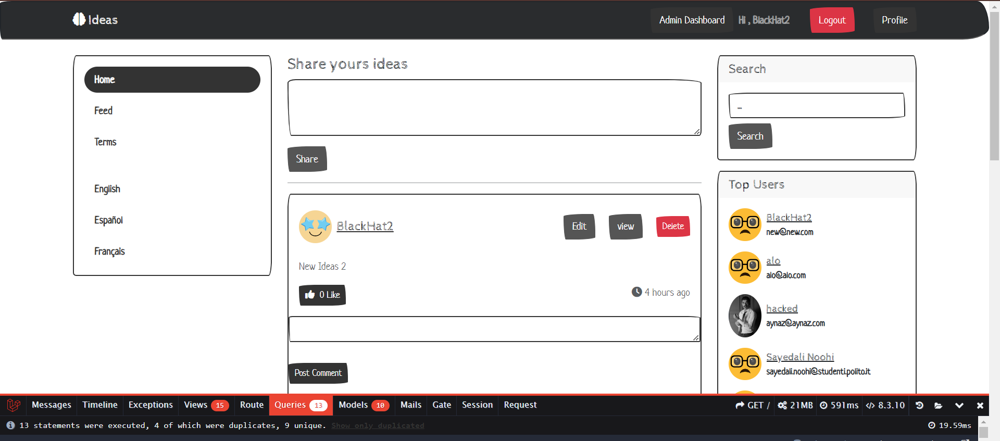
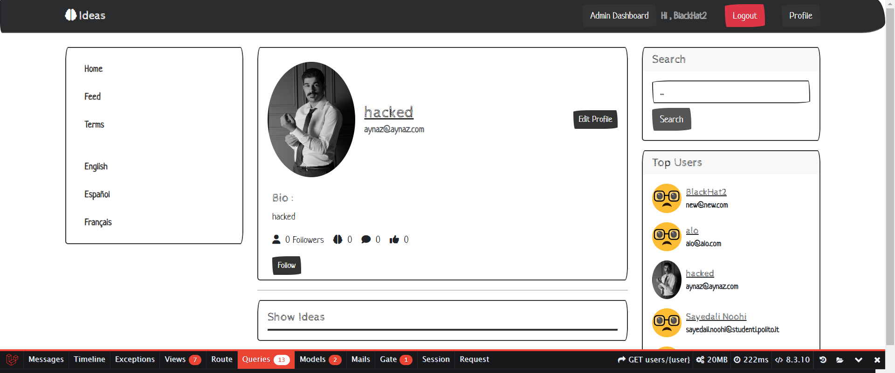
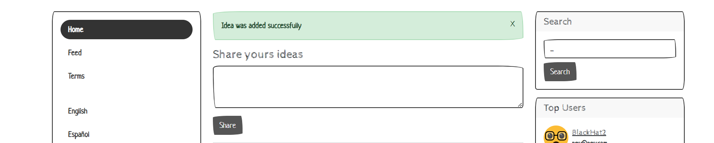
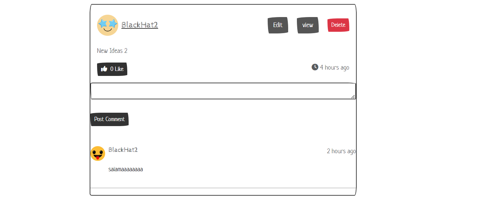

# Twitter Clone with Laravel

## Project Overview

This project is a simplified clone of Twitter built using Laravel, a popular PHP framework. The application allows users to register, log in, post tweets, follow other users, and interact with tweets through likes and comments. The project demonstrates fundamental Laravel features, including routing, Eloquent ORM, Blade templating, and authentication.

## Application Routes

- **Route `/`**: Home Page displaying a feed of tweets from followed users.
- **Route `/login`**: Login Form for users.
- **Route `/register`**: Registration Form for new users.
- **Route `/logout`**: Logout endpoint to terminate the user session.
- **Route `/profile/{username}`**: User Profile page displaying the user’s tweets, followers, and following.
- **Route `/tweet/{id}`**: Detailed view of a single tweet, including comments.
- **Route `/tweet/create`**: Form to create a new tweet.
- **Route `/tweet/{id}/edit`**: Form to edit an existing tweet.
- **Route `/tweet/{id}/delete`**: Endpoint to delete a tweet.
- **Route `/users`**: List of all users for discovering and following.
- **Route `/follow/{username}`**: Endpoint to follow or unfollow a user.
- **Route `/*`**: 404 Page Not Found for any undefined routes.

## Main Laravel Controllers

- **`AuthController`**: Manages user authentication, including login and registration.
- **`HomeController`**: Handles the main feed displaying tweets from followed users.
- **`ProfileController`**: Manages user profile views, including tweets, followers, and following.
- **`TweetController`**: Handles CRUD operations for tweets, including creating, editing, and deleting tweets.
- **`CommentController`**: Manages the creation of comments on tweets.
- **`FollowController`**: Manages the follow/unfollow functionality between users.
- **`LikeController`**: Handles liking and unliking of tweets.

## Database Schema

### Tables

- **`users`** - *id*, *name*, *email*, *password*, *created_at*, *updated_at*
- **`tweets`** - *id*, *user_id*, *content*, *created_at*, *updated_at*
- **`comments`** - *id*, *tweet_id*, *user_id*, *comment_text*, *created_at*, *updated_at*
- **`likes`** - *id*, *user_id*, *tweet_id*, *created_at*, *updated_at*
- **`follows`** - *id*, *follower_id*, *followed_id*, *created_at*, *updated_at*

### Relationships

- **User**: A user can have many tweets, comments, likes, and followers.
- **Tweet**: A tweet belongs to a user and can have many comments and likes.
- **Comment**: A comment belongs to a tweet and a user.
- **Follow**: A follow relationship connects two users (follower and followed).

## API Endpoints

### `GET /api/tweets`
- **Purpose:** Retrieve all tweets from followed users.
- **Response Body Content:**
  - JSON array of tweet objects.
- **Response Status Codes:**
  - `200 OK`: Successfully retrieved tweets.
  
### `POST /api/tweet`
- **Purpose:** Create a new tweet.
- **Request Body:**
  - `content`: The content of the tweet.
- **Response Status Codes:**
  - `201 Created`: Successfully created the tweet.
  - `400 Bad Request`: Missing content.

### `POST /api/tweet/{id}/comment`
- **Purpose:** Post a comment on a tweet.
- **Request Body:**
  - `comment_text`: The content of the comment.
- **Response Status Codes:**
  - `201 Created`: Successfully posted the comment.
  - `400 Bad Request`: Missing comment text.

### `POST /api/tweet/{id}/like`
- **Purpose:** Like a tweet.
- **Response Status Codes:**
  - `200 OK`: Successfully liked the tweet.

### `DELETE /api/tweet/{id}/like`
- **Purpose:** Unlike a tweet.
- **Response Status Codes:**
  - `200 OK`: Successfully unliked the tweet.

### `POST /api/follow/{username}`
- **Purpose:** Follow or unfollow a user.
- **Response Status Codes:**
  - `200 OK`: Successfully followed or unfollowed the user.

## Screenshots

### Home Page


### User Profile


### Tweet Creation


### Comments on Tweet


## User Credentials for Testing

- **Username**: `user1`, **Password**: `password`
- **Username**: `user2`, **Password**: `password`

## How to Run the Project

 **Clone the repository**:
   ```bash
   git clone https://github.com/alinhi75/Twitter-Laravel-.git
   cd Twitter-Laravel-
   php artisan migrate
   php artisan db:seed
   php artisan serve


